# BoxFlow：一个基于Nodejs + electron开发的桌面AI Agent应用

AI很美好，让我们可以通过自然语言去操控各种各样的工具。使用自然语言能够让我们更灵活的操控应用，但是也增加了使用者的使用难度。个人开发者的能力有限，希望大家可以与我一块儿来完善这个应用。个人微信


## 基本能力

* LLM的访问能力
* 基于TBox可视化定义工作流与智能体能力
* 私有化部署的能力
* 行业报告调查能力
* 自主决策运行大模型能力
* Excel分析能力、Word分析能力、股票分析能力、本地文件助手、网页助手能力

## 软件介绍

### 1.聊天

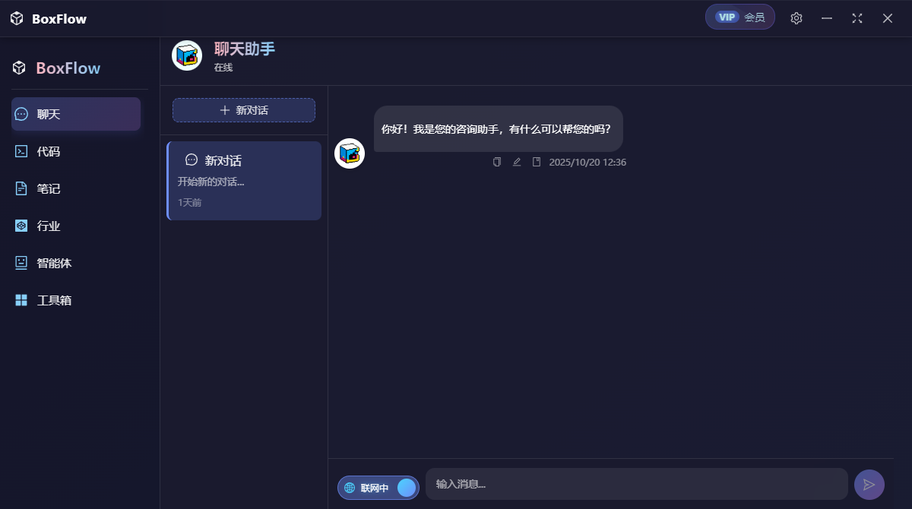

BoxFlow的聊天功能基于百宝箱内置的深度求索（DeepSeek）最新一代大语言模型作为核心技术支撑。该智能系统不仅具备强大的自然语言理解和生成能力，还创新性地整合了实时联网搜索功能，能够主动获取并分析互联网上的最新数据信息。这种双重技术架构确保了智能体在知识更新、信息准确性和响应时效性方面都保持卓越表现。通过持续优化的算法模型与实时数据获取的完美结合，百宝箱智能体可以为用户提供更加智能、精准且与时俱进的交互体验，满足各类复杂场景下的信息需求。无论是时效性强的新闻资讯，还是专业领域的深度知识，都能通过该智能体获得高质量的解答。

同时，软件中的聊天功能还可以将智能体回复的消息快速发送到笔记模块，以及对消息生成可视化的网页功能。只需要使用按钮组中的功能即可。

### 2.代码能力

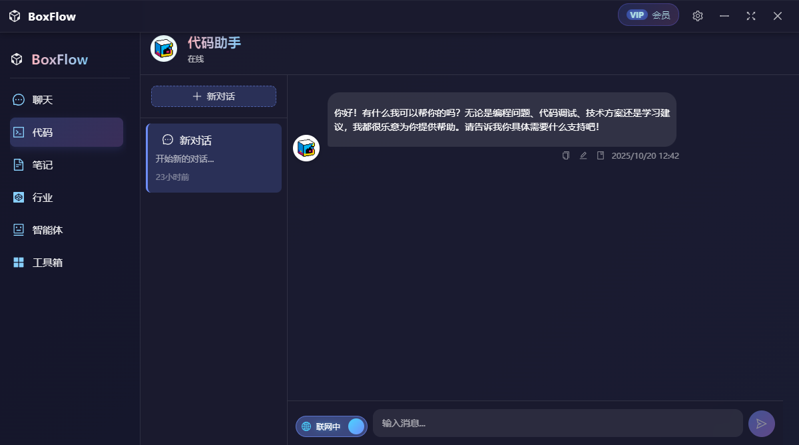

BoxFlow的代码能力基于百宝箱智能体的的**Qwen3 Coder**模型构建，具备**Coder**模型构建，具备强大的代码理解、生成与优化能力。该智能体支持多种编程语言（如Python、Java、C++、JavaScript等），能够高效完成代码补全、错误调试、算法优化等任务，并可根据自然语言描述自动生成高质量的可执行代码。同时，结合智能体的联网搜索能力，它能够实时获取最新的技术文档、开源项目及API参考，确保代码建议符合行业最佳实践。无论是初学者学习编程，还是开发者提升效率，BoxFlow智能体都能提供精准、高效的代码辅助，显著提升开发体验。

### 3.笔记功能

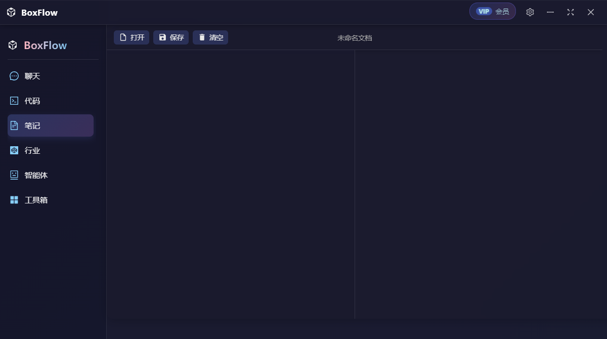

基于开发者以及办公用户的日常需求，BoxFlow还在软件中内置了笔记模块，用户可以将BoxFlow中所有聊天中的内容一键发送到笔记模块进行快速保存，同时该模块也可以打开用户本地的文件用以预览。

### 4. 行业洞察模块

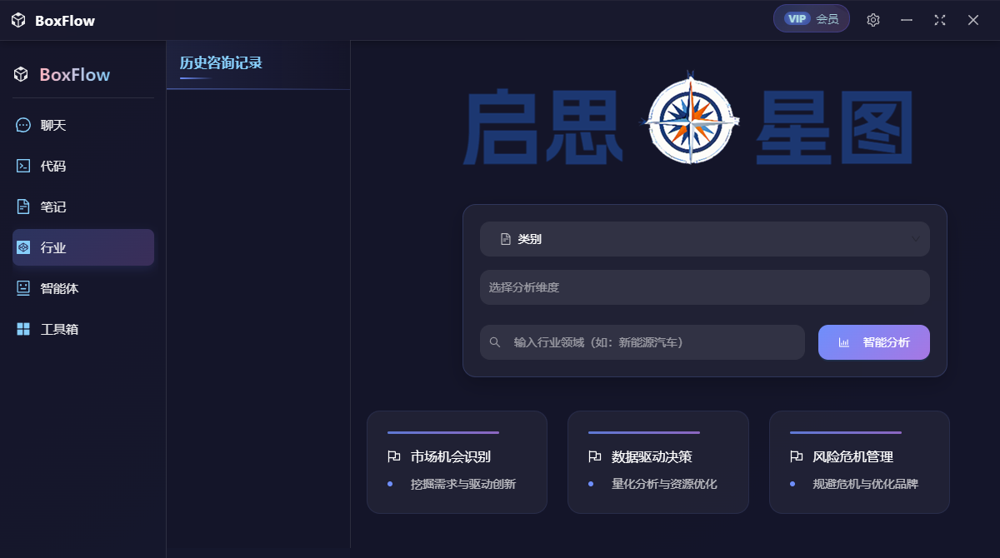

**BoxFlow的行业模块**深度整合了**多维度、多类别**的行业提示词库，能够为咨询用户提供**全面、精准**的行业与公司分析。无论是市场趋势、竞争格局、商业模式，还是风险机遇，该模块均可通过**结构化数据**和**智能推荐**，帮助用户快速把握行业动态，制定科学决策。其**定制化分析**功能进一步满足不同场景需求，助力用户高效完成行业研究与企业战略规划。

#### 行业洞察执行

在行业洞察界面选择完分析维度以及填充完成对应行业信息后，点击智能分析按钮即可进行行业分析，下方是行业分析执行的过程。

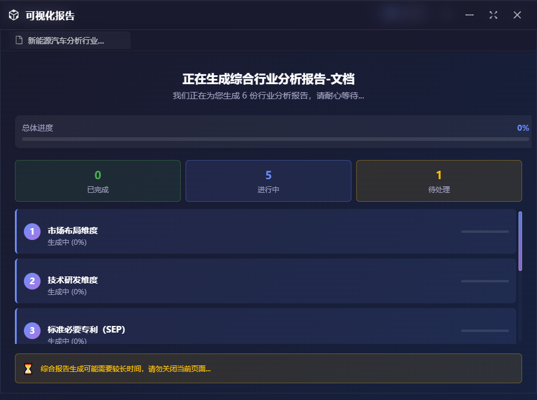

#### 行业洞察结果

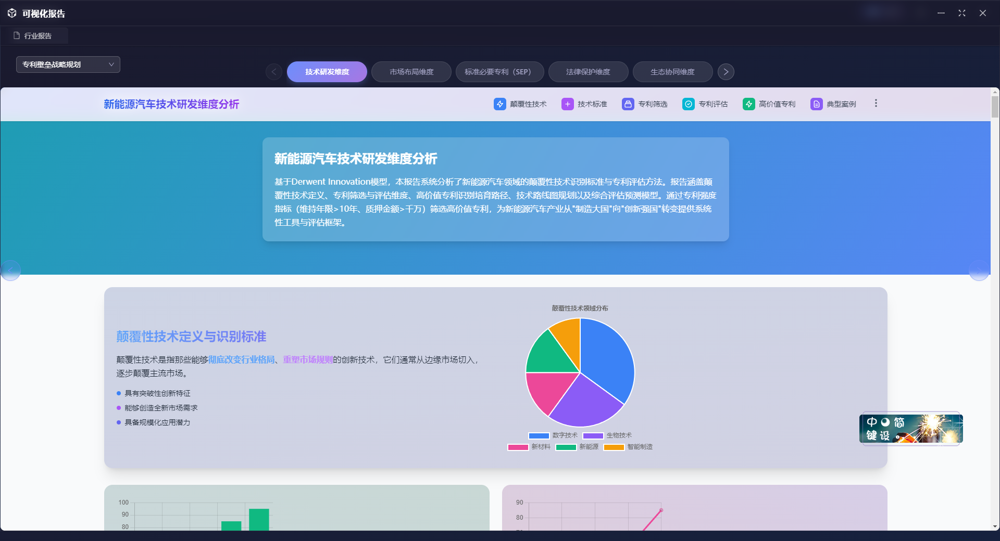

行业洞察执行完成后，会跳转到行业报告界面，，左侧下拉框为洞察类别，TAG上方展示的是行业维度。点击对应的TAG即可跳转到指定的维度上。

### 5.多智能体

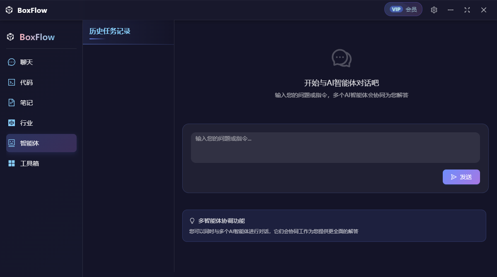

BoxFlow的智能体模块可以帮助用户快速的进行深度搜索能力，该模块中具有多种能力

* 计划者
* 信息分析大师
* 报告整理大师
* 工程师

#### 执行过程

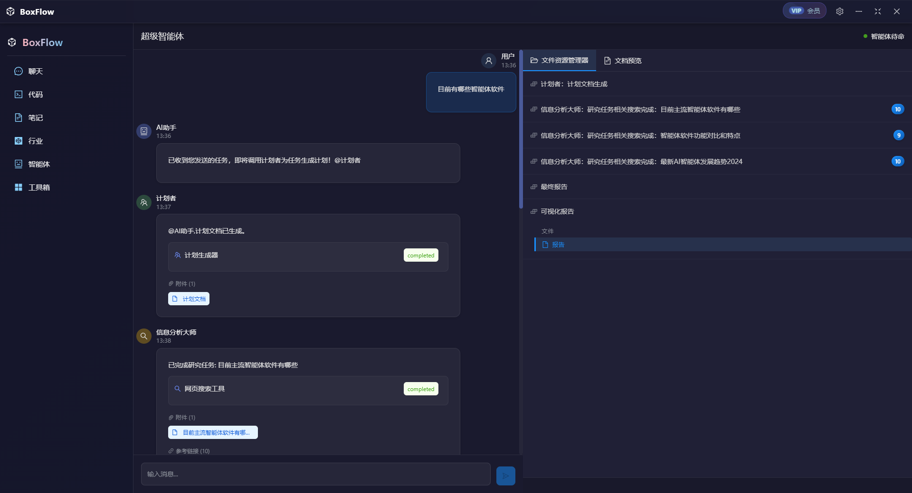

#### 执行结果

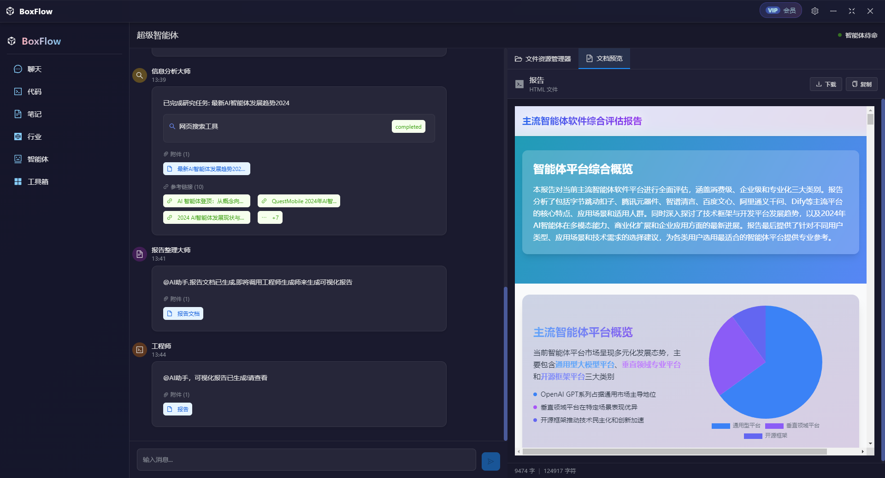

### 6.Excel功能

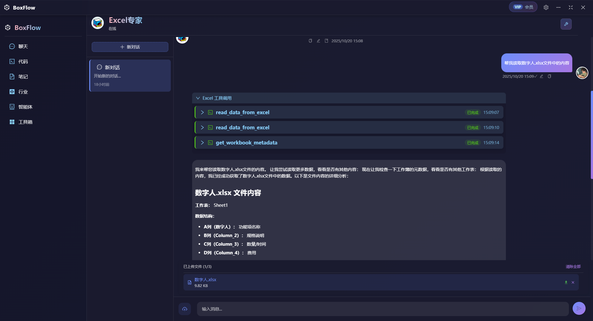

BoxFlow中的Excel功能可以将用户上传的Excel文档进行解析，解析完成后可以通过自然语言来查询Excel表中的内容，BoxFlow会返回excel中的内容。读取出来的内容也可以生成对应的网页报告。

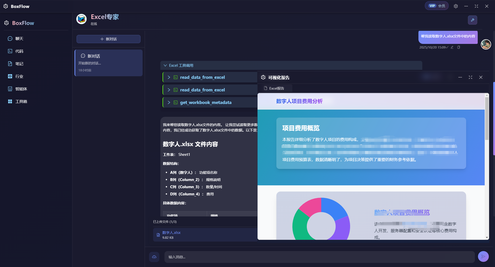

### 7.浏览器助手

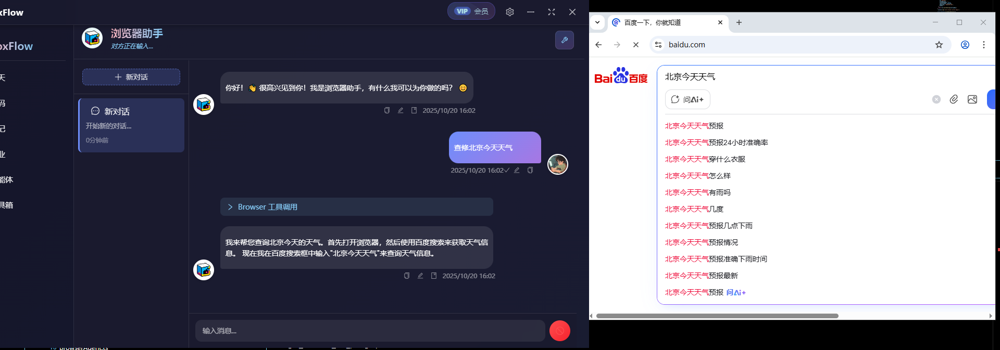

BoxFlow中的浏览器助手可以通过自然语言调度本地的浏览器进行操作并且可以将浏览器返回的内容输出到回复中。

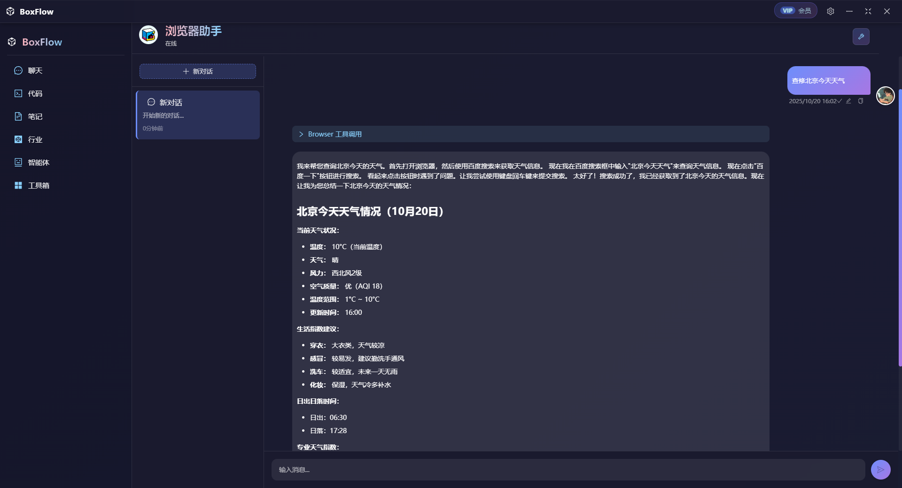

上方是回复的消息内容。

#### 配置本地浏览器

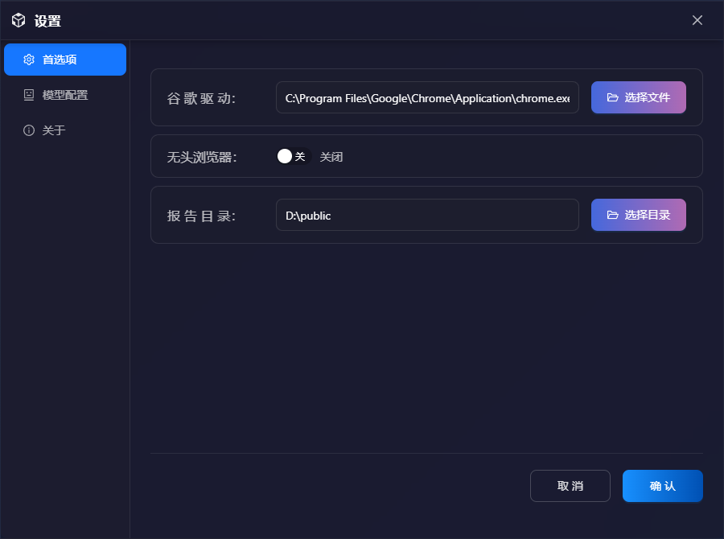

点击选择文件按钮选择谷歌浏览器的快捷方式，无头浏览器用来配置浏览器是否启动。

### 8.股票分析助手

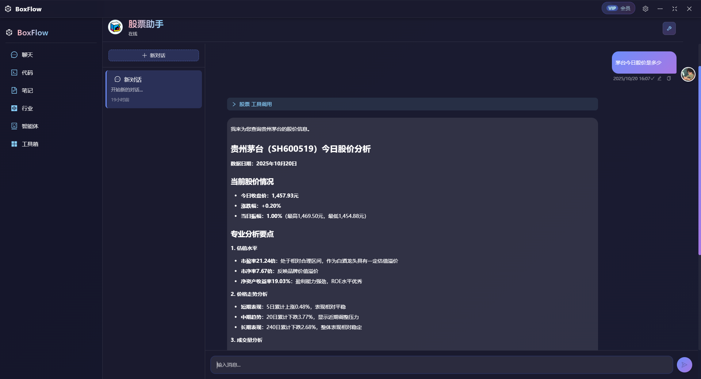

股票分析助手中可以查询国内股票的价格，并且其中提供了股票的专业分析。

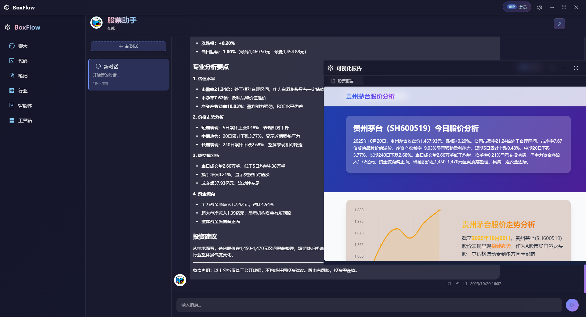

上图是股票助手的相关报告。

### 9.文件助手


BoxFlow的文件工具可以使用自然语言读取操作用户本地的文件或者文件夹。

### 10.网页助手

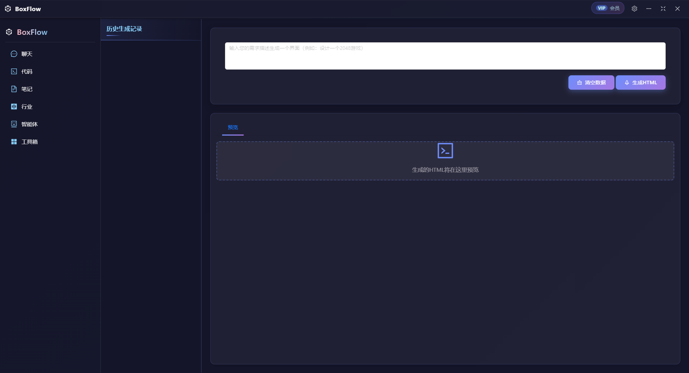

在该功能中，用户可以通过一句话生成一个相应网页功能。例如小游戏等等。

### 11.Word助手

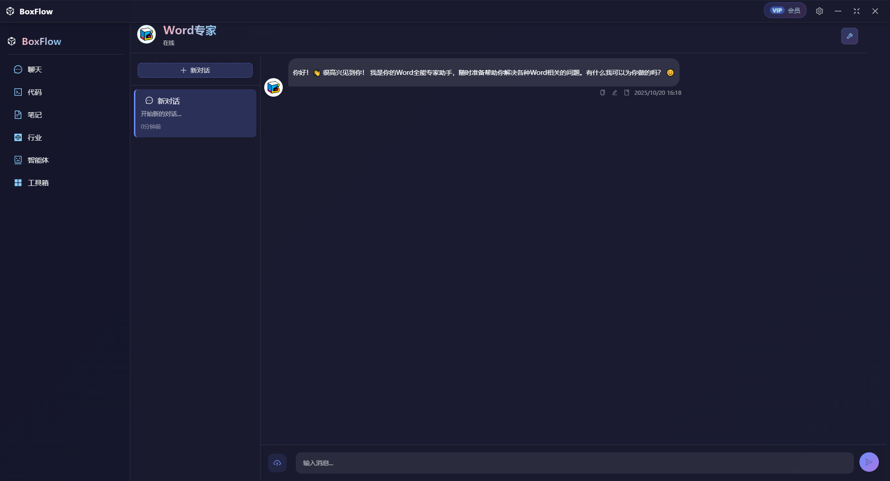

BoxFlow提供了操作以及解析Word的相关功能，在该功能中可以使用自然语言来操控相关word文档。

## 项目启动

### 环境

Nodejs >= 18

python3.10

### 安装

```bash
$ npm install
```

### 开发环境

```bash
$ npm run dev
```

### 打包

```bash
# For windows
$ npm run build:win

# For macOS
$ npm run build:mac

# For Linux
$ npm run build:linux
```


